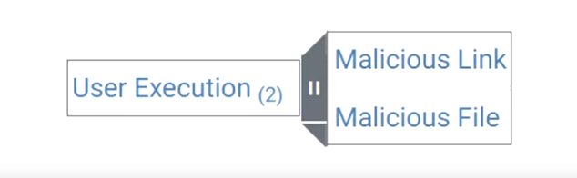

# User execution

• The end user is a common and good target for a cybercriminal

Users are easier to trick than technical defenses
 A user account may have the permissions that the attacker needs for their attack

• Social engineering attacks are designed to convince a user to take a dangerous action
— Clicking a malicious link
— Opening a malicious file

