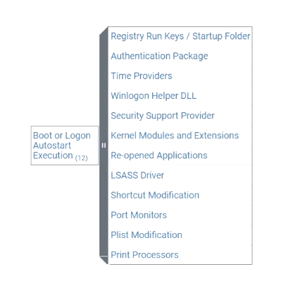

# Boot or Logon Autostart Execution

- Many different system processes are run on
boot or logon
— Run the processes needed by the system
— Configure the user profile
    
    — User applications wanting to always be running
    
- Malware can take advantage of this autorun
functionality
    
     — Add malware binaries or script code to autorun
          locations
    

