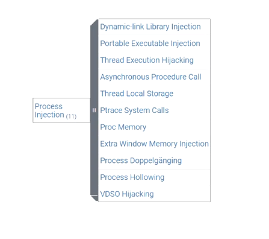

# **Process Injection**

- Many applications are reliant on third-party
code:

    — DLLs
  
    — Libraries
  
    — External applications
    
- These dependencies can be used for privilege
escalation.

    — Replace a legitimate dependency with a malicious
      version

    — Higher-privilege process loads and runs the
      malicious library
  

